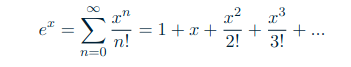
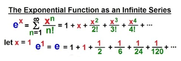
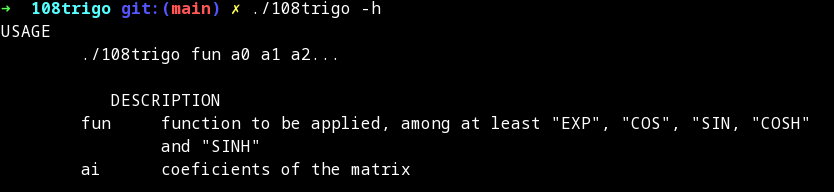
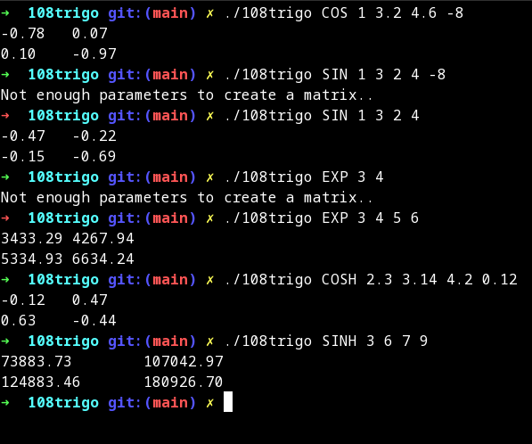

#  __Matrix Power Series__

## Français

#### Comme vous le savez peut-être (ou non), la fonction exponentielle peut être écrite comme la somme d'une série de puissances :

De même, de nombreuses autres fonctions, telles que les fonctions trigonométriques et hyperboliques, peuvent être écrites sous forme de série de puissances.

Ces séries de puissances sont extrêmement utiles pour obtenir rapidement des approximations de toutes ces fonctions. Mais elles peuvent également être utilisées pour effectuer des opérations exponentielles sur des objets mathématiques (Les objets mathématiques peuvent être concrets, tels que les nombres, les figures géométriques, les fonctions) à condition que ces objets puissent être élevés à des puissances entières. On pourrait par exemple calculer le cosinus d'une fonction, l'exponentiation d'un graphe, la tangente hyperbolique d'une rotation ou le sinus d'une matrice carrée.

Étant donné une matrice et le nom d'une fonction, votre programme doit appliquer cette dernière à la première et afficher le résultat. Les matrices sont données en arguments. Bien entendu, les bibliothèques de gestion de matrices ne sont pas autorisées. Espérons que vous avez déjà écrit des fonctions efficaces pour calculer les puissances de matrices !

Pour exécuter le programme, utilisez la commande suivante :

Où la fonction est le nom de la fonction à appliquer à la matrice, et la matrice est la matrice donnée en arguments.

Les __fonctions supportées__ sont :

   - cos
   - cosh
   - sin
   - sinh
   - exp

Par exemple, vous pouvez exécuter :

## English

##### As you may know (or not), the exponential function can be written as the sum of a power series:

So do many other functions, such as trigonometric and hyperbolic functions.

These power series are extremely useful when it comes to fast approximations of all those functions. But they can also be used to perform exponential operations on mathematical objects (which can be concrete objects such as numbers, geometric figures, functions) provided that these objects can be raised to integer powers. One could, for example, compute the cosine of a function, the exponentiation of a graph, the hyperbolic tangent of a rotation or the sine of a square matrix.

Given a matrix and the name of a function, your program must apply the latter to the former and print the result. Matrices are given as arguments. Obviously, matrix-managing libraries are not allowed. Hopefully, we already did a matrix management in a previous maths project but it was in ___C___.

To run the program, use the following command:

Where function is the name of the function to be applied to the matrix, and matrix is the matrix given as arguments

The __supported functions__ are:

   - cos
   - cosh
   - sin
   - sinh
   - exp

For example you can run : 

